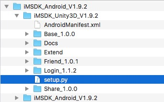
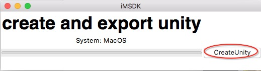
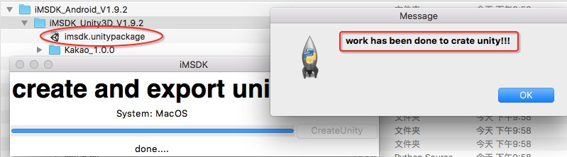

## 4.1 下载及使用

### 下载插件包

请进入iTop官网业务下载界面：[https://open.itop.qq.com/download](https://open.itop.qq.com/download)，选择游戏需要的SDK进行下载

### 环境依赖

1. Unity >= 4.6，下载地址：[https://store.unity.com/cn](https://store.unity.com/cn)
2. Python，下载地址：[https://www.python.org](https://www.python.org)

### 打包方法

1. 解压下载后的zip包，进入iMSDK_Android_V?/iMSDK_Unity3D_V?.?.?目录

  

2. 执行打包脚本

  ```shell
  $ python setup.py
  ```

3. 点击界面中“CreateUnity”按钮

  

4. 等待完成后，会在目录中生成imsdk.unitypackage文件

  

5. 双击生成的文件unitypackage，导入Unity工程即可

> 如果打包过程中遇到任何问题，请联系RTX：yuanchengsu

### 插件导入

* Android

  通过下载Android插件的包，进行打包时已经包含Android插件，无需进行额外操作

* iOS

  需要Unity编译成XCode工程后，进行插件导入，具体请查看iMSDK iOS文档

### 下一步

[配置开发环境](setupenv.md)

