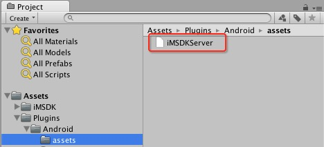

# 4.2 设置开发环境

## Android工程配置

### HTTPS证书文件

  Unity中的文件路径为：

  ```sh
  Assets/Plugins/Android/assets/iMSDKServer.cer
  ```

  
  
  iMSDK插件包在提供的时候，已经提供了测试环境下的HTTPS证书文件。

  如果需要替换证书，可以参考如下方法获取证书：

  在Linux（或Mac）系统中，可以通过如下shell命名获取HTTPS证书
  
  ```sh
  $ IMSDK_SERVER=sdkapi-beta.itop.qq.com
  $ echo -n | openssl s_client -showcerts -connect $IMSDK_SERVER:443 | openssl x509 -outform DER > iMSDKServer.cer
  ```
  
  > 注意：sdkapi-beta.itop.qq.com为iMSDK测试服务器，游戏需要根据自己的真是服务器地址进行修改

  另外，我们还可以借助浏览器进行文件导出，Mac下用Safari即可，Windows下面我们建议使用Chrome。在浏览器中输入HTTPS地址，如：
  
  ```html
  https://sdkapi-beta.itop.qq.com
  ```
  
  * Mac系统，点击Safari导航栏中的锁形图标，点击“显示证书”，点击弹窗下方证书图标进行拖拽到桌面或者文件夹中即可复制文件，将文件重名名为iMSDKServer.cer即可
  
  * Windows系统较为复杂
  
    1. 在导航栏中点击锁形，弹窗中选择“连接”页签，点击“证书信息”
    2. 在证书信息中，选择“详细信息”页签，点击“复制到文件”，弹出导出向导，点击“下一步”
    3. 证书文件选择“DER 编码二进制 X.509 (.CER)”，点击“下一步”
    4. 点击“浏览”选择保存文件路径，并将文件命名为iMSDKServer.cer


### 配置基础信息

  Android工程配置主要是修改Assets/Plugins/AndroidManifest.xml文件

  * Game ID 配置

      在每个游戏接入的时候，都会分配一个游戏ID作为iMSDK应用标识

      在AndroidManifest.xml中找到配置项：

      ```xml
      <meta-data android:name="com.tencent.imsdk.GameId" android:value="\ 11"/>
      ```

      将value值修改为对应的游戏ID。注意，前面的"\\"和空格须保留

  * iMSDK 服务器地址配置

      在AndroidManifest.xml中找到配置项：

      ```xml
      <meta-data android:name="com.tencent.imsdk.SdkServer" android:value="sdkapi-beta.itop.qq.com"/>
      ```

      将value值修改为对应的iMSDK服务器地址，不需要添加 “ https:// ”头

  * 日志级别配置

      在AndroidManifest.xml中找到配置项：

      ```xml
      <meta-data android:name="com.tencent.imsdk.debug.level" android:value="2" />
      ```
      将value值修改为对应的日志级别：
      
      * 2 - Vibose
      * 3 - Debug
      * 4 - Info
      * 5 - Warn
      * 6 - Error
      * 7 - Assert


  * Debug 服务器Host配置[\*]:

      \*一般情况下不需要配置。该配置项主要是用于服务器未配置域名的情况，此时服务器地址可以填写IP，在本配置项中填写服务器地址，如：

      ```xml
      <meta-data android:name="com.tencent.imsdk.DebugServerHost" android:value="sdkapi-beta.itop.qq.com"/>
      <meta-data android:name="com.tencent.imsdk.SdkServer" android:value="103.7.28.42"/>
      ```

## iOS工程配置
  
iOS的所有配置，都需要在Unity中编译导出XCode工程后，在XCode工程进行配置

### 编译选项

  在XCode工程 -> Build Settings -> Linking -> Other Linker Flags 中，添加如下编译选项：
  
  ```sh
  -all_load
  ```
  
  如果遇到Bitcode报错（Unity 4.x版本不支持），可以通过在XCode工程 -> Build Settings -> Build Options -> Enable Bitcode 中，将值修改为No

### HTTPS证书文件
    
  将iMSDKServer.cer证书文件拖到XCode工程中，并在XCode工程 Build Phases -> Copy Bundle Resources中，确认iMSDKServer.cer文件已经添加到拷贝列表
    
  > 如果没有，可以点击下方“+”，在弹出的选择框中选中添加的证书文件，点击“Add”进行添加
   
  *iMSDKServer.cer证书文件获取方法可以参考Android HTTPS配置部分说明*
   
### 添加资源和插件

**请参考iOS文档进行配置**
    
### 基础代码调用

  Unity编译导出XCode工程后，需要在工程中添加必要的代码，iMSDK插件才能正常运行
  
  * 添加头文件

    在XCode工作中，找到UnityAppController.mm文件，添加头文件引用
    
    ```mm
    #import <IMSDKCoreKit/IMSDKCoreKit.h>
    ```
  * 增加代码调用
    
    1. 处理应用启动 
      
      在UnityAppController.mm文件AppDelegate中，找到如下方法
    
      ```mm
      - (BOOL)application:(UIApplication *)application didFinishLaunchingWithOptions:(nullable NSDictionary *)launchOptions
      ```
    
      并在返回前添加如下代码调用
    
      ```mm
      [[IMSDKApplicationDelegate sharedInstance] application:application
                               didFinishLaunchingWithOptions:launchOptions
                                              withGameSecret:@"YOUR_GAME_SECRET"];
      ```
      
      > YOUR_GAME_SECRET 为游戏访问iMSDK服务器秘钥串，需要换成真实的秘钥串，可以跟iMSDK后台获取
      > 
      > 联系人RTX：hirryli
  
    2. 处理应用拉起
  
      在UnityAppController.mm文件AppDelegate中，找到如下方法
    
      ```mm
      - (BOOL)application:(UIApplication *)application openURL:(NSURL *)url sourceApplication:(nullable NSString *)sourceApplication annotation:(id)annotation
      ```
      
      并在返回前添加如下代码调用
      
      ```mm
      [[IMSDKApplicationDelegate sharedInstance] application:application
                                                          openURL:url
                                                sourceApplication:sourceApplication
                                                       annotation:annotation];
      ```
  
### 基础信息配置

  iOS工程配置主要是修改添加的IMSDKAppSetting.bundle资源文件目录下Contents/Resources/app.plist配置

  * Game ID 配置
  
    在每个游戏接入的时候，都会分配一个游戏ID作为iMSDK应用标识
    
    在XCode工程中，找到IMSDKAppSetting.bundle/Contents/Resources/app.plist文件，增加或修改如下配置：
    
    ```xml
    <key>GameId</key>
	<string>11</string>
    ```
    
    将string值修改为对应的游戏ID
  
  * iMSDK 服务器地址配置

      在XCode工程中，找到IMSDKAppSetting.bundle/Contents/Resources/app.plist文件，增加或修改如下配置：

      ```xml
      <key>IMSDKServer</key>
      <string>sdkapi-beta.itop.qq.com</string>
      ```

      将string值修改为对应的iMSDK服务器地址，不需要添加 “ https:// ”头

  * 日志级别配置

      在XCode工程中，找到IMSDKAppSetting.bundle/Contents/Resources/app.plist文件，增加或修改如下配置：

      ```xml
      <key>IMSDKLogLevel</key>
      <integer>1</integer>
      ```
      将integer值修改为对应的日志级别：
      
      * 1 - Debug
      * 2 - Info
      * 3 - Warn
      * 4 - Error
      * 5 - Assert
      
    
  * Debug 服务器Host配置[\*]:

      \*一般情况下不需要配置。该配置项主要是用于服务器未配置域名的情况，此时服务器地址可以填写IP，在本配置项中填写服务器地址，如：

      ```xml
      <key>IMSDKServer</key>
      <string>103.7.28.42</string>
      <key>IMSDKServerHost</key>
      <string>sdkapi-beta.itop.qq.com</string>
      ```
  