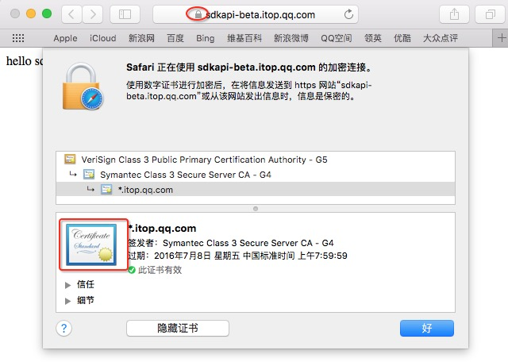

## 4.2 配置开发环境

目前，iMSDK支持Android和iOS两大平台代码调用，可以根据应用需要分别进行配置

1. [Android工程配置](android.md)
2. [iOS 工程配置](ios.md)


如果需要替换证书，可以参考如下方法获取证书：

1. 脚本获取

  在Linux（或Mac）系统中，可以通过如下shell命名获取HTTPS证书

  ```sh
  $ IMSDK_SERVER=sdkapi-beta.itop.qq.com
  $ echo -n | openssl s_client -showcerts -connect $IMSDK_SERVER:443 | openssl x509 -outform DER > iMSDKServer.cer
  ```

  运行结果：

  ```
  depth=2 /C=US/O=VeriSign, Inc./OU=VeriSign Trust Network/OU=(c) 2006 VeriSign, Inc. - For authorized use only/CN=VeriSign Class 3 Public Primary Certification Authority - G5
  verify error:num=20:unable to get local issuer certificate
  verify return:0
  DONE
  ```

  可以在工作目录找到证书文件

  ```
  ls -al iMSDKServer.cer
  -rw-r--r--  1 AeonYang  staff  1285  6 30 10:45 iMSDKServer.cer
  ```

  > 注意：sdkapi-beta.itop.qq.com为iMSDK测试服务器，游戏需要根据自己的真实服务器地址进行修改

2. 浏览器导出

  另外，我们还可以借助浏览器进行文件导出，Mac下用Safari即可，Windows下面我们建议使用Chrome。在浏览器中输入HTTPS地址，如：
  
  ```html
  https://sdkapi-beta.itop.qq.com
  ```
  
  * Mac系统，点击Safari导航栏中的锁形图标，点击“显示证书”，点击弹窗下方证书图标进行拖拽到桌面或者文件夹中即可复制文件，将文件重名名为iMSDKServer.cer即可
  
  
  
  * Windows系统较为复杂
  
    1. 在导航栏中点击锁形，弹窗中选择“连接”页签，点击“证书信息”
    2. 在证书信息中，选择“详细信息”页签，点击“复制到文件”，弹出导出向导，点击“下一步”
    3. 证书文件选择“DER 编码二进制 X.509 (.CER)”，点击“下一步”
    4. 点击“浏览”选择保存文件路径，并将文件命名为iMSDKServer.cer


